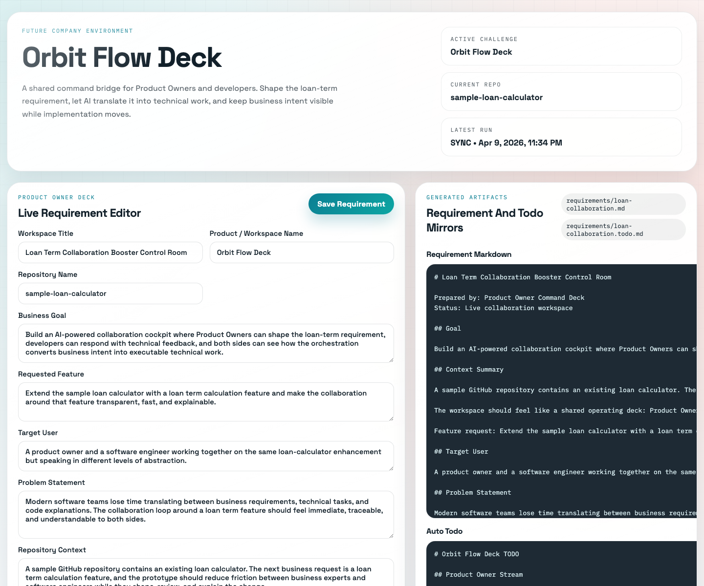
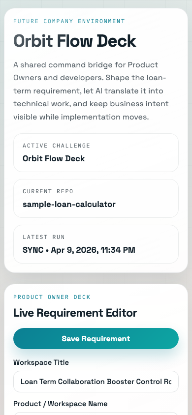

# OpenAI Role Orchestration Demo

AI-powered collaboration cockpit for Product Owners and developers, built on top of the OpenAI SDK and the OpenAI Agents SDK.

The current prototype is shaped around the loan-calculator challenge: a business user needs to extend an existing loan calculator with a loan term feature, but the real problem is the collaboration gap between product intent and technical delivery. This repo turns that gap into a visible workflow.

## Screenshots

Desktop cockpit:



Mobile cockpit:



## What This Prototype Does

The browser UI gives both sides a shared operating surface:

- Product Owners edit the live requirement in the UI instead of editing markdown by hand.
- Developers leave comments, questions, and decisions in the same workspace.
- AI answers questions about the repo in business language or technical language depending on who is asking.
- The orchestration engine can still generate a brief, a developer plan, a review, and a delivery bundle from that same requirement.

This means the prototype is not just a static dashboard. It is a working bridge between:

- business requirements
- AI translation
- technical planning
- implementation delivery
- explainability back to the Product Owner

## How It Works

The flow is:

1. The Product Owner updates the active challenge requirement in the web UI.
2. The server persists the structured workspace state.
3. The server automatically regenerates:
   - `requirements/loan-collaboration.md`
   - `requirements/loan-collaboration.todo.md`
4. Developers can add comments or questions in-context.
5. Users can ask AI questions about the repository or the latest orchestration output.
6. Users can trigger `async`, `sync`, or `deliver` orchestration runs from the browser.
7. The UI reads `.runs/latest/` and shows the latest brief, plan, review, and implementation bundle summary.

In practice, that gives the team one shared loop:

- define the feature
- clarify open questions
- translate it into technical work
- review alignment
- ship a generated implementation bundle
- explain the outcome back in product language

## Main Areas In The UI

### Product Owner Deck

This is the live requirement editor. It captures:

- business goal
- feature request
- scope
- constraints
- acceptance criteria
- validation checks
- Product Owner questions

Saving from this panel rewrites the markdown artifacts automatically.

### Generated Artifacts Deck

This shows the exact requirement and todo markdown the orchestration engine will consume. That keeps the process inspectable and avoids “magic” prompt behavior hidden from the team.

### Human Collaboration Deck

This is the in-app thread for developer comments, questions, and decisions. Those thread entries also feed back into the generated requirement and todo so the Product Owner sees the latest technical signals.

### AI Bridge

This lets either role ask questions against the current workspace, latest run snapshot, and key repo files.

- Product Owner mode prioritizes business-friendly explanations.
- Developer mode prioritizes direct technical answers.

### Orchestration Deck

This is the browser control surface for the existing orchestration runtime:

- `Generate Brief` -> `async`
- `Review Plan` -> `sync`
- `Ship Bundle` -> `deliver`

## Repo Structure

- `src/server.ts` serves the UI and API.
- `src/collaboration/workspace.ts` persists the workspace and regenerates markdown.
- `src/collaboration/assistant.ts` powers the role-aware AI Q&A flow.
- `src/engine/orchestrationEngine.ts` coordinates Product Owner, Developer, Reviewer, and delivery runs.
- `web/` contains the plain HTML, CSS, and JavaScript cockpit.
- `data/loan-collaboration-workspace.json` stores the current seeded collaboration state.
- `requirements/loan-collaboration.md` is the generated requirement source for the challenge.
- `requirements/loan-collaboration.todo.md` is the synchronized companion todo file.
- `.runs/` stores structured orchestration artifacts.

## Run Locally

Set `OPENAI_API_KEY` in `.env`, then run:

```bash
npm install
npm run run:ui
```

Open:

```text
http://127.0.0.1:3000
```

The CLI entry points are still available:

```bash
npm run run:async
npm run run:developer
npm run run:sync
npm run run:deliver
```

## Run With Docker Compose

```bash
docker compose up --build
```

This starts the same collaboration UI in a container and exposes it on port `3000` by default.

## Notes

- `run:ui` starts the futuristic collaboration cockpit.
- `run:async` creates the Product Owner brief only.
- `run:developer` resumes developer planning from an existing brief.
- `run:sync` runs Product Owner -> Developer -> Reviewer.
- `run:deliver` runs the full flow and writes the generated project bundle to the resolved `target_workspace`.
- `.runs/latest/` is rewritten only after a completed command, so stale intermediate files do not leak into the latest snapshot.

## More Detail

- [How The System Works](docs/how-the-system-works.md)
- [Collaboration UI Prototype](docs/collaboration-ui-prototype.md)
- [OpenAI Orchestration Research](docs/openai-orchestration-research.md)
